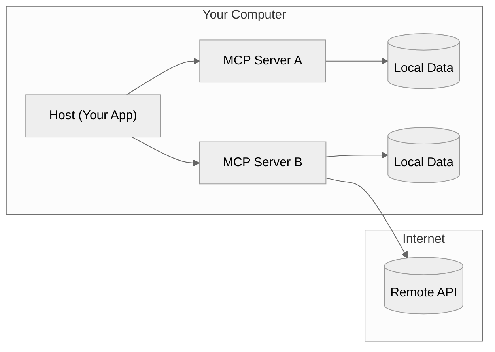
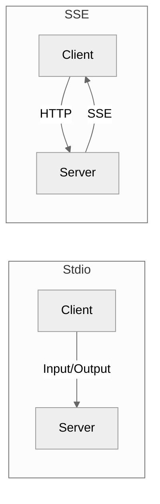

## Understanding MCP Technically

### How MCP Works: The Architecture

The Model Context Protocol (MCP) uses a **client-host-server** setup to connect large language models (LLMs) to tools and data. This modular design lets each part focus on a specific job, like accessing files or calling APIs.

- **MCP Hosts**: Apps like your Python program or an IDE that use MCP to access tools.
- **MCP Clients**: Connect hosts to servers, one client per server.
- **MCP Servers**: Small programs that provide specific functions, like file access or web searches, via MCP.
- **Local Data**: Files or databases on your computer that servers can access.
- **Remote Services**: External systems (e.g., APIs) that servers can connect to over the internet.

Here’s a simple diagram of how it fits together:

### Core MCP Features

MCP servers can provide three main things:

1. **Tools**: Functions LLMs can call, like running calculations or querying APIs.
2. **Resources**: Data (e.g., files or database records) that give LLMs context.
3. **Prompts**: Templates to guide LLM interactions.

For Python developers, **tools** are the most practical starting point, letting LLMs trigger actions in your app.

### How MCP Communicates: Transport Methods

MCP supports two ways for clients and servers to talk:

1. **Stdio (Standard Input/Output)**:
   - Uses standard input/output streams.
   - Best for local setups where the client and server are on the same machine.
   - Easy to set up, no network needed.

2. **SSE (Server-Sent Events)**:
   - Uses HTTP for client-to-server messages and SSE for server-to-client.
   - Great for remote setups across networks.
   - Supports distributed systems.

**When to use each**:
- **Stdio**: For single-app setups or testing.
- **SSE**: For remote access or apps needing network connections.

Here’s how they compare:

If you’ve used **FastAPI**, building an MCP server with SSE will feel familiar. Both use HTTP endpoints and support streaming responses, making it easy for FastAPI developers to pick up MCP.

### Why MCP Matters

MCP’s strength is in **standardization**, not new features. This brings big benefits:
- **Reuse**: Build one server, use it with any MCP-compatible client.
- **Combine**: Mix multiple servers for complex tasks.
- **Community**: Use servers others have built or share your own.

The MCP ecosystem is growing fast, with many ready-to-use servers. Check them out at [MCP Servers](https://github.com/modelcontextprotocol/servers).